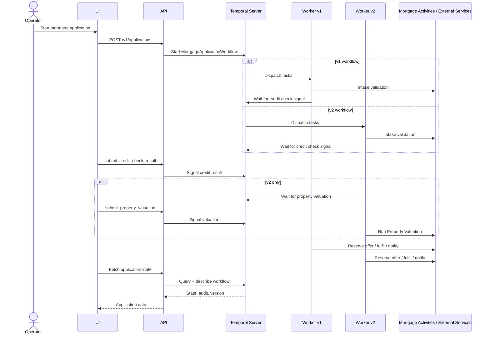

# Mortgage Application Demo

A Temporal-powered demo showcasing orchestration of a long-running mortgage
application, including async dependencies, operator interaction, failure
handling and safe workflow evolution.

<!-- toc -->

* [Overview](#overview)
  * [What it demonstrates](#what-it-demonstrates)
  * [Scenarios](#scenarios)
  * [Defect in new deployment (v2)](#defect-in-new-deployment-v2)
  * [Why this demo matters](#why-this-demo-matters)
  * [Service interactions](#service-interactions)
  * [Running the demo](#running-the-demo)
  * [Suggested demo flow](#suggested-demo-flow)
  * [Observability and metrics](#observability-and-metrics)
    * [Grafana provisioning](#grafana-provisioning)
    * [Custom metric labels](#custom-metric-labels)
    * [Useful Prometheus queries](#useful-prometheus-queries)
    * [Suggested Grafana demo flow](#suggested-grafana-demo-flow)
    * [Suggested Prometheus demo flow](#suggested-prometheus-demo-flow)

<!-- Regenerate with "pre-commit run -a markdown-toc" -->

<!-- tocstop -->

## Overview

This is a reusable Temporal demo built around a realistic mortgage
application flow. It is intended for live demonstrations and self-paced
learning, not as production software. The mortgage domain is intentionally
simplified so the orchestration story stays in focus. This demo also
includes a simulated defect scenario showing how Temporal behaves when a
faulty deployment is introduced.

The repository is split into three applications:

* `apps/worker` is the Go Temporal worker that owns orchestration.
* `apps/api` is a NestJS API that provides a thin control surface for the UI.
* `apps/ui` is a SvelteKit UI used by the operator during the demo.

Temporal itself runs as an existing platform dependency through Docker
Compose. It is the orchestration engine and is not re-implemented or
abstracted by the apps.

### What it demonstrates

The demo exercises the Temporal capabilities most relevant to enterprise
orchestration:

* Durable orchestration that survives worker restarts and transient failures.
* Safe waiting for external events using Temporal signals, including an
  async credit check signal and a v2 property valuation signal.
* Auditability through an ordered business timeline visible in the UI.
* Observability via the UI, the API and the Temporal Web UI.
* Retry and failure handling driven by Temporal retry policies rather than
  workflow control flow.
* SLA visibility for async dependencies, with live progress while waiting
  and a durable outcome once the wait resolves.
* Safe compensation using a real compensating activity.
* Safe re-run of an application without losing the original audit history.
* Safe workflow evolution from v1 to v2 using Worker Deployment Versioning,
  where new applications adopt the change and in-flight applications
  continue safely.

### Scenarios

Each application can be started with one of several demo scenarios. They
are selected from the start form in the UI.

* **Happy path**: a successful application from intake through to
  fulfilment and notification. Available in both v1 and v2.
* **Failure and compensation**: a forced failure after offer reservation
  triggers a compensating activity that releases the reserved offer.
* **Retry and re-run**: the operator can retry a failed credit check or
  re-run the entire application from the original inputs.
* **SLA visibility**: while the workflow is waiting on an async dependency
  the UI shows time remaining against the SLA and flags breaches durably.
* **Versioning**: starting an application after promoting v2 routes new
  applications to v2 while in-flight v1 applications keep running on v1.
* **Failure injection**: the happy path scenario exposes a configurable
  `externalFailureRatePercent` slider. It causes eligible activities to
  fail randomly so Temporal retry policies can be observed absorbing
  transient errors without operator intervention.

### Defect in new deployment (v2)

A defect has been introduced in the v2 workflow logic. When a property
value of `350001` is submitted, the workflow panics during execution.

Temporal retries the workflow task automatically, but the workflow
cannot make progress and remains in a running state. The trigger is
deterministic and operator controlled, not random, so it can be opted
into or skipped during a live demo.

In-flight v1 applications are unaffected. Worker Deployment Versioning
pins them to the v1 worker that started them, so a bad v2 deployment
cannot poison work that started before the promotion.

Observable behaviour:

* The workflow does not progress beyond the property valuation step.
* The application remains in a running state.
* The audit timeline shows the last successful step.
* No downstream actions (offer reservation, fulfilment or notification)
  are executed.

Recovery options:

* Roll back to the previous worker version:

  ```bash
  DEPLOYMENT_VERSION=mortgage-worker-v1 make set-worker-version
  ```

* Or deploy a fixed v2 worker and promote it.

After recovery, re-run the workflow using the existing operator action.
The workflow will resume from the beginning without duplicating side
effects.

This scenario demonstrates how Temporal isolates the impact of
defective code. Even though the workflow logic is broken, no partial
or duplicate side effects occur. The system remains in a consistent
state and can be safely recovered by fixing or rolling back the
deployment.

Suggested demo flow:

1. Deploy and promote v2.
2. Start a new application.
3. Submit the credit check.
4. Submit the property valuation as `350001`.
5. Observe the workflow stalled in a running state with no progress.
6. Roll back to v1 or deploy a fixed v2.
7. Re-run the application.
8. Observe successful completion with no duplicate effects.

### Why this demo matters

Coordinating a mortgage application means waiting for slow external
systems, recovering from partial failures and proving what happened to
auditors months later. Doing that without an orchestration engine usually
ends in queues, ad hoc state machines and brittle retry code that is hard
to reason about and harder to change.

Temporal makes durability, retries and signal handling part of the
runtime. This demo makes that visible:

* **Durability**: workflow state survives worker restarts and host
  failures without manual recovery.
* **Coordination of async work**: external dependencies are modelled as
  signals so the workflow waits explicitly without polling or external
  queues.
* **Auditability**: every step lands on an ordered business timeline that
  matches the operator view in the UI.
* **Safe change**: Worker Deployment Versioning lets v2 take over new
  applications without disrupting in-flight v1 work.

### Service interactions

At a high level, the system behaves as follows:



### Running the demo

Make is the entry point for the demo. The targets below cover the full v1
to v2 narrative without exposing Docker Compose directly.

Start the system:

```bash
make deploy
```

Deploy the v2 worker alongside v1:

```bash
make deploy-v2
```

Promote v2 as the active worker version:

```bash
make set-worker-version
```

Roll back to v1:

```bash
DEPLOYMENT_VERSION=mortgage-worker-v1 make set-worker-version
```

Tear the demo down:

```bash
make destroy
```

### Suggested demo flow

1. Start the system with `make deploy`.
2. Start a v1 application from the UI.
3. Submit the credit check result and observe the workflow continue
   straight to offer reservation, with no valuation step.
4. Deploy the v2 worker with `make deploy-v2`.
5. Promote v2 with `make set-worker-version`.
6. Start a new application. It runs on v2.
7. Submit the credit check result for the v2 application.
8. Submit the property valuation. The v2 workflow uses the submitted value
   before reserving the offer.
9. Compare the two applications side by side. v1 completes without a
   valuation, v2 includes one, and both share the same intake, credit
   check, fulfilment and notification steps.
10. Inspect the audit timeline, the SLA indicators and the workflow
    version badge for both applications to confirm the difference is
    durably recorded.

### Observability and metrics

The worker exposes a Prometheus metrics endpoint that covers both the
standard Temporal SDK metrics and the custom mortgage business metrics
emitted from activities. Prometheus scrapes the worker metrics endpoint
over the internal Docker network and treats the v1 and v2 workers as
separate scrape targets. Grafana runs as part of the same Docker Compose
stack, provisioned to read from Prometheus and pre-loaded with both the
Temporal SDK dashboard and a custom mortgage dashboard.

Grafana is the primary visual surface for the demo:

* Grafana: <http://localhost:3001>
* Credentials: `admin` / `admin`. Anonymous viewer access is also enabled,
  so the dashboards open without signing in.

Prometheus is still exposed for ad hoc queries:

* Prometheus: <http://localhost:9090>
* Query UI: <http://localhost:9090/graph>

Both come up automatically with `make deploy`. There is no separate
Grafana command and no dashboard update workflow.

When v2 is not deployed, its Prometheus target will appear as down. This
is expected. When `make deploy-v2` is run, the v2 target becomes available
automatically.

This is intentionally lightweight. Application logs remain plain
structured logs and metrics are scoped to the demo. All logs include
the ApplicationId and can be correlated with workflow execution in
Temporal. A production platform would normally ship logs and metrics
to existing tooling such as Prometheus, Grafana, Datadog, Splunk or
ELK. The demo proves the metrics integration path rather than building
a full observability platform.

#### Grafana provisioning

Grafana is provisioned automatically from files under `dev/grafana/`,
which is local demo tooling rather than deployment configuration. There
is no manual import or data source setup.

* The Prometheus data source is provisioned as `Prometheus` and marked as
  default.
* Two dashboard folders are loaded on startup:
  * **Mortgage Demo** contains the custom `Mortgage Application Demo`
    dashboard with the business metrics described below.
  * **Temporal** contains the standard Temporal SDK dashboard vendored
    from
    [temporalio/dashboards](https://github.com/temporalio/dashboards).
    The JSON is checked in directly and intentionally kept static for
    demo repeatability. Its data source variable is normalised so it
    resolves to the provisioned Prometheus on first open.

A fresh clone works immediately. No JSON is fetched at runtime and no
extra setup command is required.

#### Custom metric labels

The mortgage business metrics carry these labels:

* `version` is the worker profile (`v1` or `v2`), injected at worker
  registration time.
* `scenario` is the demo scenario the application was started with.
* `outcome` is the terminal outcome (`approved` or `rejected`) and is
  only set on the completion counter.

#### Useful Prometheus queries

Worker scrape health:

```promql
up{job="mortgage-worker"}
```

Shows whether Prometheus can scrape each worker. Run this first so a
silent metric is not mistaken for a missing event.

Applications started:

```promql
mortgage_applications_started_total
```

Increments when the intake activity succeeds.

Applications completed by outcome:

```promql
mortgage_applications_completed_total
```

Increments when the notification activity runs for an approved or
rejected application.

Approved applications:

```promql
mortgage_applications_completed_total{outcome="approved"}
```

Shows approved applications.

Compensated applications:

```promql
mortgage_applications_compensated_total
```

Increments when the offer release compensation succeeds.

Completions by version and outcome:

```promql
sum by (version, outcome) (mortgage_applications_completed_total)
```

Shows completions grouped by worker version and outcome.

Starts by version and scenario:

```promql
sum by (version, scenario) (mortgage_applications_started_total)
```

Shows starts grouped by worker version and scenario.

Compensation by version and scenario:

```promql
sum by (version, scenario) (mortgage_applications_compensated_total)
```

Shows compensation grouped by worker version and scenario.

#### Suggested Grafana demo flow

1. Open Grafana at <http://localhost:3000>.
2. Open the **Mortgage Application Demo** dashboard from the
   `Mortgage Demo` folder.
3. Confirm the worker scrape health panel shows the v1 worker as `Up`.
   The v2 worker reads `Down` until `make deploy-v2` is run, which is
   expected.
4. Start and complete a v1 application from the UI. The started and
   completed panels increment.
5. Run `make deploy-v2` and `make set-worker-version` to promote v2,
   then complete a v2 application.
6. Show the version split on the dashboard: the started, completed and
   rate panels now break out v1 and v2 separately.
7. Trigger a compensation scenario and observe the
   `Compensated applications` panel and the compensation table populate.
8. Open the `Temporal` folder and the `Temporal SDK (Go/Java, Tally)`
   dashboard to show standard worker and runtime metrics on the same
   data source.

#### Suggested Prometheus demo flow

1. Open Prometheus at <http://localhost:9090/graph>.
2. Run `up{job="mortgage-worker"}` to confirm scraping.
3. Start and complete a v1 application.
4. Deploy and promote v2, then complete a v2 application.
5. Re-run grouped queries to show metrics split by version.
6. Trigger a compensation scenario and query
   `mortgage_applications_compensated_total`.
7. Observe how metrics differentiate between v1 and v2 executions
   without any additional instrumentation changes.
