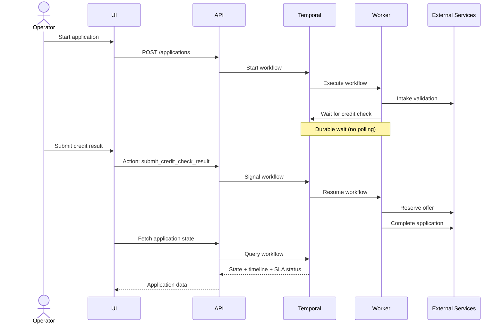
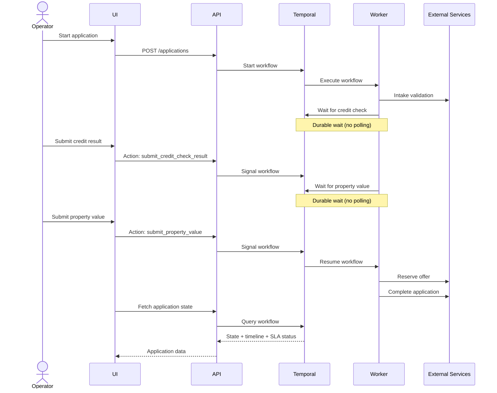

# Mortgage Application Demo

A Temporal-powered demo showcasing orchestration of a long-running mortgage
application, including async dependencies, operator interaction, failure
handling and safe workflow evolution.

---

<!-- toc -->

* [Overview](#overview)
* [What it demonstrates](#what-it-demonstrates)
* [How it works](#how-it-works)
  * [v1](#v1)
  * [v2](#v2)
* [Scenarios](#scenarios)
* [Running the demo](#running-the-demo)
* [Suggested demo flow](#suggested-demo-flow)
* [Defect scenario (v2)](#defect-scenario-v2)
* [Observability and metrics](#observability-and-metrics)
  * [Access](#access)
  * [Workflow search attributes](#workflow-search-attributes)
  * [Metrics overview](#metrics-overview)
  * [Example queries](#example-queries)
  * [Suggested observability demo](#suggested-observability-demo)
* [Why this matters](#why-this-matters)

<!-- Regenerate with "pre-commit run -a markdown-toc" -->

<!-- tocstop -->

## Overview

This is a reusable Temporal demo built around a realistic mortgage application
flow. It is designed for live demonstrations and self-paced learning rather
than production use.

The mortgage domain is intentionally simplified so the orchestration story
stays in focus.

The repository is split into three applications:

* `apps/worker` — Go Temporal worker (workflow + activities)
* `apps/api` — NestJS API (control surface)
* `apps/ui` — SvelteKit UI (operator view)

Temporal itself runs via Docker Compose and acts as the orchestration engine.

---

## What it demonstrates

This demo focuses on the core capabilities required for enterprise orchestration:

* Durable workflows that survive restarts and failures
* Explicit waiting for async external dependencies via signals
* Full audit timeline of business events
* Operational observability (UI + Temporal Web)
* Retry handling driven by Temporal policies
* SLA visibility for async dependencies
* Compensation via real activities
* Safe re-run of workflows without corrupting history
* Safe evolution from v1 → v2 using Worker Deployment Versioning

---

## How it works

A high-level view of how the system orchestrates application processing using
Temporal workflows and external services.

### v1

The initial version processes an application with a single external input, the
credit check result, delivered via a workflow signal.



### v2

This version extends the workflow by introducing an additional external input,
the property value, adding a second signal and durable wait before completion.



---

## Scenarios

The UI allows selecting different demo scenarios:

* **Happy path** — full successful flow
* **Failure + compensation** — fulfilment fails and triggers release of
  reserved offer
* **Retry and re-run** — operator retries credit check or re-runs the workflow
* **SLA visibility** — shows wait time, deadline and breach status
* **Versioning** — v2 introduces property valuation while v1 continues safely
* **Failure injection** — simulate flaky external systems via a failure rate
  slider

---

## Running the demo

Use `make` as the entry point.

Start the system:

```bash
make deploy
```

Deploy v2 alongside v1:

```bash
make deploy-v2
```

Promote v2:

```bash
make set-worker-version
```

Roll back to v1:

```bash
DEPLOYMENT_VERSION=mortgage-worker-v1 make set-worker-version
```

Tear down:

```bash
make destroy
```

---

## Suggested demo flow

1. Start the system (`make deploy`)
2. Run a **happy path** application
3. Show:
   * async wait
   * SLA tracking
   * audit timeline
4. Demonstrate **operator retry**
5. Run a **failure + compensation** scenario
6. Show **re-run** behaviour
7. Demonstrate **failure injection** (e.g. 30–50%)
8. Deploy and promote **v2**, show side-by-side behaviour

---

## Defect scenario (v2)

The v2 workflow includes a controlled defect:

* submitting a property value of `350001` causes a deterministic failure
* the workflow cannot progress but remains in a consistent state

Observable behaviour:

* workflow remains running
* no downstream steps execute
* audit shows last successful step

Recovery:

* roll back to v1 **or**
* deploy a fixed v2 worker

Then re-run the application safely.

This demonstrates how Temporal isolates faulty deployments without corrupting
workflow state.

---

## Observability and metrics

The demo includes built-in observability using:

* Temporal Web UI
* Prometheus
* Grafana

### Access

* Grafana: <http://localhost:3001>
* Prometheus: <http://localhost:9090>
* Temporal Web: <http://localhost:8233>

---

### Workflow search attributes

Custom search attributes expose workflow state:

* `ApplicationStatus`
* `CurrentStep`
* `AwaitingExternalSignal`
* `HasOffer`
* `WithinSLA`

These allow filtering and inspection directly in Temporal Web.

---

### Metrics overview

The worker exposes Prometheus metrics including:

* applications started
* applications completed
* compensation events
* version split (v1 vs v2)
* scenario labels

---

### Example queries

```promql
up{job="mortgage-worker"}
```

```promql
mortgage_applications_started_total
```

```promql
sum by (version, outcome) (mortgage_applications_completed_total)
```

```promql
mortgage_applications_compensated_total
```

---

### Suggested observability demo

1. Open Grafana dashboard
2. Run v1 and v2 applications
3. Show version split
4. Trigger compensation scenario
5. Show compensation metrics
6. Inspect workflow in Temporal Web

---

## Why this matters

Real mortgage workflows involve:

* slow external systems
* partial failures
* strict audit requirements
* long-lived state

Temporal provides:

* durable execution
* safe async coordination
* complete auditability
* controlled evolution of workflows

This demo makes those capabilities visible and tangible.
